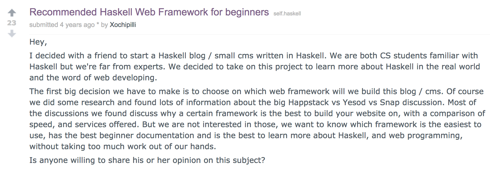
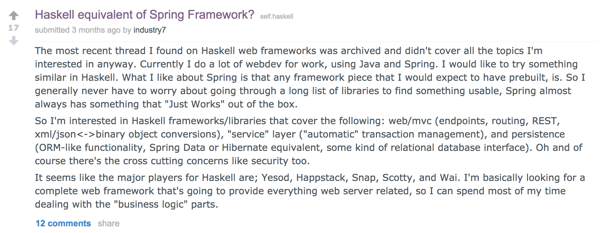

class: center, bottom, heading-black
background-image: url(images/ambiata-chopsticks.png)

# Caught in a web of functions

---

class: middle



---

class: middle



---

## Haskell Web Frameworks

- Happstack
- Scotty
- Snap
- Yesod
- Airship
- Spock
- Servant

---

class: center, middle, section-aqua, heading-white

# Scotty

---

class: middle, center, code

```haskell
ActionM = Request + Response
```

---

class: code

```haskell
main :: IO ()
main =
  scotty 8080 routes

routes = do
  get "/" $
    ...
  get "/login" $
    ...
  post "/login" $
    ...
  get "/profile/:user" $
    ...
```

---

class: code

```haskell
get "/" $
  secure $ \session ->
    redirect ("/profile/" <> session)
```

---

class: code

```haskell
get "/login" $
  html . concat $ [
    , "<form method=\"POST\" action=\"/login\">"
    , "  <input name=\"username\" />"
    , "</form>"
    ]
```

---

class: code

```haskell
post "/login" $ do
  user <- param "username"
  setCookie (makeCookie "session" user)
  redirect ("/profile/" <> user)
```

???

- Content-Type

---

class: code

```haskell
get "/profile/:user" $
  secure $ \session -> do
    user <- param "user"
    if session /= user then do
      status status403
      html "<body>Unauthorized"
    else
      html "<body>Authorized"
```

???

- Split into multiple page

---

class: code

```haskell
secure :: (Session -> ActionM ()) -> ActionM ()
secure f = do
  c <- getCookie "session"
  case c of
    Nothing ->
      redirect "/login"
    Just s ->
      f (Session s)
```


---

class: center, middle, section-aqua, heading-white

# What is a web application?

???

- "Let's take a step back"
- TODO Image?

---

class: center, middle, code

```haskell
Request -> Response
```

---

class: center, middle, code

```haskell
Request -> IO Response
```

???

- "But this is haskell and we need to be able to do side effects"

---

class: center, middle, section-aqua, heading-white

# Web Application Interface

---

class: center, middle, section-aqua, heading-white

# WAI

---

class: code

```haskell
data Request =
  Request {
      pathInfo :: [Text]
    , requestMethod :: Method
    , requestHeaders :: [Header]
    , ...
    }

data Response =
  Response {
      responseStatus :: Status
    , responseHeaders :: [Header]
    , ...
    }
```

---

class: code

```haskell
get "/" $
  secure $ \session ->
    redirect ("/profile/" <> session)
```

```haskell
redirect :: Text -> ActionM ()
```

---

class: middle, code

``` haskell
responseLBS ::
  Status -> [Header] -> ByteString -> Response
```

---

class: code

```haskell
myRedirect :: Text -> Response
myRedirect location =
  responseLBS
    status302
    [("Location", location)]
    ""
```

???

- Ignore the body for now - will discuss later

---

class: middle, center, code

``` haskell
setResponse :: Response -> ActionM ()
```

---

class: code

```haskell
get "/" $
  secure $ \session ->
    setResponse
      (myRedirect ("/profile/" <> session))
```


---

class: code

```haskell
get "/login" $
  html $
    concat [
      , "<form method=\"POST\" action=\"/login\">"
      , "  <input name=\"username\" />"
      , "</form>"
      ]
```

---

class: code

```haskell
get "/login" $
  setResponse . responseLBS status200 [] $
    concat [
      , "<form method=\"POST\" action=\"/login\">"
      , "  <input name=\"username\" />"
      , "</form>"
      ]
```

---

class: code

```haskell
post "/login" $ do
  user <- param "username"
  setCookie (makeCookie "session" user)
  redirect ("/profile/" <> user)
```

---

class: middle, center, code

```haskell
setCookie :: Cookie -> ActionM ()
```

---

class: code

```haskell
mapResponseHeaders ::
  ([Header] -> [Header]) ->
  Response ->
  Response
```

```haskell
setMyCookie :: Cookie -> Response -> Response
setMyCookie c =
  mapResponseHeaders $ \hs ->
    ("Set-Cookie", renderSetCookie c) : hs
```

---

class: code

```haskell
post "/login" $ do
  user <- param "username"
  setResponse $
    setMyCookie (makeCookie "session" user) $
      myRedirect ("/profile/" <> user)
```

---

class: code

```haskell
request :: ActionM Request

requestBody :: Request -> IO ByteString

parseQueryText :: ByteString -> [(Text, Maybe Text)]
```

---

class: code

```haskell
post "/login" $ do
  request <- request
  b <- requestBody request
  case lookup "username" (parseQueryText b) of
    Nothing ->
      setResponse $
        responseLBS status400 []
          "<body>Bad request"
    Just user ->
      setResponse $
        setMyCookie (makeCookie "session" user) $
          myRedirect ("/profile/" <> user)
```


---

class: code

```haskell
get "/profile/:user" $
  secure $ \session ->
    user <- param "user"
    if session /= user then do
      status status403
      html "<body>Not allowed"
    else
      html "<body>Hello"
```

---

class: code

```haskell
get "/profile/:user" $
  secure $ \session ->
    user <- param "user"
    setResponse $
      if session /= user then
        responseLBS status403 []
          "<body>Not allowed"
      else
        responseLBS status200 []
          "<body>Hello"
```

---

class: code

```haskell
secure :: (Session -> ActionM ()) -> ActionM ()
secure f = do
  c <- getCookie "session"
  case c of
    Nothing ->
      redirect "/login"
    Just s ->
      f (Session s)
```

---

class: middle, center, code

```haskell
getCookie :: Text -> ActionM (Maybe Text)
```

---

class: code

```haskell
getMyCookie :: Request -> Text -> Maybe Text
getMyCookie request name = do
 cs <- lookup "Cookie" (requestHeaders request)
 lookup name (parseCookies cs)
```

---

class: code

```haskell
secure ::
  Request ->
  (Session -> IO Response) ->
  IO Response
secure request f =
  case getMyCookie request "session" of
    Nothing ->
      return (redirect "/login")
    Just s ->
      f (Session s)
```


---

class: center, middle, section-aqua, heading-white

# Routing

---

class: code

```haskell
routes = do
  get "/" $
    ...
  get "/login" $
    ...
  post "/login" $
    ...
  get "/profile/:user" $
    ...
```

---

class: center, middle, code

```haskell
pathInfo :: Request -> [Text]
```

---

class: code

```haskell
myRoutes :: Request -> IO Response
myRoutes request =
  case pathOf request of
    [] ->
      ...
    ["login"] ->
      ...
    ["profile", user] ->
      ...
    _ ->
      ???
```

???

- "Interesting, now _we_ have to deal with the 404"

---

class: code

```haskell
myRoutes :: Request -> IO Response
myRoutes request =
  case pathOf request of
    [] ->
      ...
    ["login"] ->
      ...
    ["profile", user] ->
      ...
    _ ->
      responseLBS status404 []
        "<body>Not found"
```

???

- Less than ideal, what does the 404 look like?

---

class: middle, center, code

```haskell
requestMethod :: Request -> Method

type Method = ByteString
```

---

class: code

```haskell
myRoutes :: Request -> IO Response
myRoutes request =
  case pathOf request of
    ...
    ["login"] ->
      case requestMethod request of
        "GET" ->
           ...
        "POST" ->
           ...
        _ ->
          responseLBS status405 []
            "<body>Not Allowed"
```

---

class: code

```haskell
routes :: ScottyM ()
routes = do
  ...
  get "/profile/:user" $
    user <- getParam "username"
```

???

- Needs type safety

---

## Haskell Routing

- web-routes
- snap-web-routes
- web-routes-boomerang
- reroute

???

- I'm not suggesting pattern matching is way to do routing
- Cottage Industry


---

class: center, middle, section-aqua, heading-white

# How do I run it?

---

class: code

```haskell
main :: IO ()
main =
  scotty 8080 $ do
    r <- request
    resp <- myRoutes r
    setResponse resp
```

```haskell
request :: ActionM Request

myRoutes :: Request -> IO Response
```

---

class: middle, center, code

```haskell
scottyApp :: ScottyM () -> IO Application
```

---

class: middle, center, code

```haskell
type Application = Request -> IO Response
```

---

class: center, middle, section-aqua, heading-white

# Warp

???

- One of the most common web servers

---

class: center, middle, code

```haskell
run :: Port -> Application -> IO ()
```

---

class: code

```haskell
main :: IO ()
main = do
  app <- scottyApp $ do
    r <- request
    resp <- myRoutes r
    setResponse resp
  run 8080 app
```

---

class: center, middle, section-yellow, heading-black

# WAI Not

---

class: code

```haskell
run :: Port -> (Request -> IO Response) -> IO ()

myRoutes :: Request -> IO Response
```
---

class: code

```haskell
run :: Port -> (Request -> IO Response) -> IO ()

myRoutes :: Request -> IO Response
```

```haskell
main :: IO ()
main =
  run 8080 myRoutes
```


---

class: center, middle, section-aqua, heading-white

# White Lie

---

class: middle, center, code

```haskell
type Application = Request -> IO Response
```

---

class: code

```haskell
type Application =
  Request ->
  (Response -> IO ResponseReceived) ->
  IO ResponseReceived
```

???

- See resources at the end

---

class: code

```haskell
type Application =
  Request ->
  (Response -> IO ResponseReceived) ->
  IO ResponseReceived
```

```haskell
main :: IO ()
main =
  run 8080 $ \request respond -> do
    response <- myRoutes request
    respond response
```

```haskell
myRoutes :: Request -> IO Response
```


---

class: center, middle, section-aqua, heading-white

# What did the web framework give us?

---

class: center, middle, section-yellow, heading-black

# Request Handling

---

class: center, middle, section-yellow, heading-black

# Response Building

---

class: center, middle, section-yellow, heading-black

# Do we need web frameworks?

---

class: center, middle, section-yellow, heading-black

# Just Functions + Data

---

## Resources

- http://blog.infinitenegativeutility.com/2016/8/resources--laziness--and-continuation-passing-style
- https://github.com/charleso/lambdajam-web-functions
- "Build yourself a Haskell web framework"
  - https://www.youtube.com/watch?v=etuSnom2v2M
