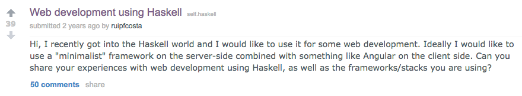
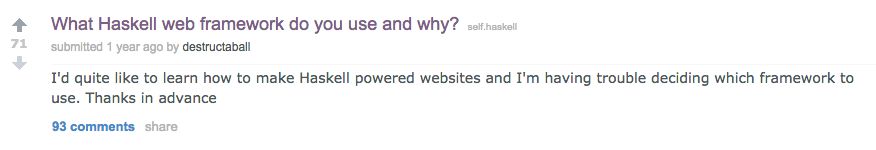

class: center, bottom, heading-black
background-image: url(images/ambiata-chopsticks.png)

# Caught in a web of functions

???

- "Part of my job is writing web applications in Haskell"

---

class: middle

<a href="https://www.reddit.com/r/haskell/comments/16kqe0/recommended_haskell_web_framework_for_beginners/">
  
</a>

---

class: middle

<a href="https://www.reddit.com/r/haskell/comments/2wfap0/web_development_using_haskell/">
  
</a>

---

class: middle

<a href="https://www.reddit.com/r/haskell/comments/1y3eff/the_simplest_haskell_web_framework_is/">
  
</a>

---

class: middle

<a href="https://www.reddit.com/r/haskell/comments/5gu7op/haskell_equivalent_of_spring_framework/">
  
</a>

---

## Haskell Web Frameworks

- Happstack
- Scotty
- Snap
- Yesod
- Airship
- Spock
- Servant

---

class: center, middle, section-aqua, heading-white

## &lt;insert contrived example&gt;

---

class: center, middle, section-aqua, heading-white

# Scotty

???

- "Pseudo code"
- "Even if you don't know Scotty should be understandable"

---

class: code

```haskell
routes = do
  get "/login" $
    ...
  post "/login" $
    ...
  get "/profile/:user" $
    ...
```

---

class: code

```haskell
get "/login" $
  html $
    "<form method="POST" action="/login">" <>
    "  <input name="username" />" <>
    "</form>"
```

---

class: code

```haskell
post "/login" $ do
  user <- param "username"
  setCookie ("session", user)
  redirect ("/profile/" <> user)
```

???

- Content-Type

---

class: code

```haskell
get "/profile/:user" $ do
  c <- getCookie "session"
  case c of
    Nothing ->
      redirect "/login"
    Just session -> do
      user <- param "user"
      if session /= user then do
        status status403
        html "<body>Unauthorized"
      else
        html "<body>Hello"
```

???

- Split into multiple page


---

class: center, middle, section-aqua, heading-white

# What is a web application?

???

- "Let's take a step back"
- TODO Image?

---

class: image, middle


---

class: code

```haskell


        DataIn      ->     DataOut
```

---

class: code

```haskell
       ByteString         ByteString
           |                  ^
           |                  |
           |                  |
           |                  |
           v                  |
        DataIn      ->     DataOut
```

---

class: code

```haskell
       ByteString         ByteString
           |                  ^
           v                  |
        Request            Response
           |                  ^
           v                  |
        DataIn      ->     DataOut
```

---

class: code

```haskell-fg


        Request            Response
```

```haskell-bg
       ByteString         ByteString
           |                  ^
           v                  |
        Request            Response
           |                  ^
           v                  |
        DataIn      ->     DataOut
```

---

class: code

```haskell


type Application =
        Request      ->    Response
```

---

class: code

```haskell

data Request


data Response
```

---

class: code

```haskell
-- http://hackage.haskell.org/package/wai
data Request = Request {
    pathInfo :: [Text]
  , requestMethod :: Method
  , requestHeaders :: [Header]
  ...
  }

data Response = Response {
    responseStatus :: Status
  , responseHeaders :: [Header]
  ...
  }
```

---

class: center, middle, section-yellow, heading-black

# Data + Functions

---

background-image: url(https://georgebrock.github.io/talks/command-line-ruby/images/lex.jpg)

???

- We're functional programmers - we know this


---

class: center, middle, section-aqua, heading-white

# What can I do with it?

---

class: code

```haskell
get "/login" $

  html $
    "<form method="POST" action="/login">" <>
    "  <input name="username" />" <>
    "</form>"
```

---

class: code

```haskell


  html $
    "<form method="POST" action="/login">" <>
    "  <input name="username" />" <>
    "</form>"
```

---

class: code

```haskell
loginGet :: Response
loginGet =
  html $
    "<form method="POST" action="/login">" <>
    "  <input name="username" />" <>
    "</form>"
```

---

class: code

<pre><code class="haskell haskell-fg">&nbsp;

  html


html :: ByteString -> Response
html body =
  ???
</code></pre>

```haskell-bg
loginGet :: Response
loginGet =
  html $
    "<form method="POST" action="/login">" <>
    "  <input name="username" />" <>
    "</form>"

html :: ByteString -> Response
html body =
  ???
```

---

class: code

```haskell
-- http://hackage.haskell.org/package/wai
responseLBS ::
  Status -> [Header] -> ByteString -> Response


html :: ByteString -> Response
html body =
  ???
```

---

class: code

```haskell
-- http://hackage.haskell.org/package/wai
responseLBS ::
  Status -> [Header] -> ByteString -> Response

-- http://hackage.haskell.org/package/http-types
status200 :: Status

html :: ByteString -> Response
html body =
  ???
```

---

class: code

```haskell
-- http://hackage.haskell.org/package/wai
responseLBS ::
  Status -> [Header] -> ByteString -> Response

-- http://hackage.haskell.org/package/http-types
status200 :: Status

html :: ByteString -> Response
html body =
  responseLBS
    status200
    [("Content-Type", "text/html")]
    body
```

---

class: code

```haskell
loginGet :: Response
loginGet =
  html $
    "<form method="POST" action="/login">" <>
    "  <input name="username" />" <>
    "</form>"

html :: ByteString -> Response
html body =
  responseLBS
    status200
    [("Content-Type", "text/html")]
    body
```

---

class: center, middle, heading-white
background-image: url(https://georgebrock.github.io/talks/command-line-ruby/images/lex.jpg)

# Data + Functions


---

class: code

```haskell
post "/login" $ do
  user <- param "username"
  setCookie ("session", user)
  redirect ("/profile/" <> user)
```

---

class: code

```haskell-fgw

          param
  setCookie
  redirect
```

```haskell-bg
post "/login" $ do
  user <- param "username"
  setCookie ("session", user)
  redirect ("/profile/" <> user)
```

---

class: code

```haskell-fgw

          param
```

```haskell-bg
post "/login" $ do
  user <- param "username"
  setCookie ("session", user)
  redirect ("/profile/" <> user)
```

---

class: code

<pre><code class="haskell haskell-fg">&nbsp;
          param


param ::
  ByteString -> Request -> Maybe ByteString
</code></pre>

```haskell-bg
post "/login" $ do
  user <- param "username"
  setCookie ("session", user)
  redirect ("/profile/" <> user)


param ::
  ByteString -> Request -> Maybe ByteString
```

???

- This is a _massive_ lie

---

class: code

```haskell-fgw


  redirect
```

```haskell-bg
post "/login" $ do
  user <- param "username"
  setCookie ("session", user)
  redirect ("/profile/" <> user)
```

---

class: code

```haskell
redirect :: ByteString -> Response
redirect uri =
  ???
```

---

class: code

```haskell
redirect :: ByteString -> Response
redirect uri =
  ???


-- http://hackage.haskell.org/package/wai
responseLBS ::
  Status -> [Header] -> ByteString -> Response
```

---

class: code

```haskell
redirect :: ByteString -> Response
redirect uri =
  responseLBS
    status302
    [("Location", uri)]
    ""

-- http://hackage.haskell.org/package/wai
responseLBS ::
  Status -> [Header] -> ByteString -> Response
```

---

class: code

```haskell-fgw


  setCookie
```

```haskell-bg
post "/login" $ do
  user <- param "username"
  setCookie ("session", user)
  redirect ("/profile/" <> user)
```

---

class: code

```haskell
setCookie :: Cookie -> Response -> Response
setCookie cookie =
  ???
```

---

class: code

<pre><code class="haskell haskell-fg">&nbsp;


-- http://hackage.haskell.org/package/wai
mapResponseHeaders ::
 ([Header] -> [Header]) -> Response -> Response
</code></pre>

```haskell-bg
setCookie :: Cookie -> Response -> Response
setCookie cookie =
  ???


-- http://hackage.haskell.org/package/wai
mapResponseHeaders ::
 ([Header] -> [Header]) -> Response -> Response
```

---

class: code

<pre><code class="haskell haskell-fg">&nbsp;


-- http://hackage.haskell.org/package/wai
mapResponseHeaders ::
 ([Header] -> [Header]) -> Response -> Response

-- http://hackage.haskell.org/package/cookie
renderCookie :: Cookie -> ByteString
</code></pre>

```haskell-bg
setCookie :: Cookie -> Response -> Response
setCookie cookie =
  ???


-- http://hackage.haskell.org/package/wai
mapResponseHeaders ::
 ([Header] -> [Header]) -> Response -> Response

-- http://hackage.haskell.org/package/cookie
renderCookie :: Cookie -> ByteString
```

---

class: code

<pre><code class="haskell haskell-fg">&nbsp;

  mapResponseHeaders $ \hds ->
    ("Set-Cookie", renderCookie cookie) : hds
</code></pre>

```haskell-bg
setCookie :: Cookie -> Response -> Response
setCookie cookie =
  mapResponseHeaders $ \hds ->
    ("Set-Cookie", renderCookie cookie) : hds

-- http://hackage.haskell.org/package/wai
mapResponseHeaders ::
 ([Header] -> [Header]) -> Response -> Response

-- http://hackage.haskell.org/package/cookie
renderCookie :: Cookie -> ByteString
```

---

class: code

```haskell-fgw

          param
  setCookie
  redirect
```

```haskell-bg
post "/login" $ do
  user <- param "username"
  setCookie ("session", user)
  redirect ("/profile/" <> user)
```

---

class: code

```haskell
loginPost :: Request -> Response
loginPost request =
  ???
```

---

class: code

<pre><code class="haskell haskell-fg">&nbsp;


    user = param "username" request


param ::
  ByteString -> Request -> Maybe ByteString
</code></pre>

```haskell-bg
loginPost :: Request -> Response
loginPost request =
  let
    user = param "username" request
  in
    ...


param ::
  ByteString -> Request -> Maybe ByteString
```

---

class: code

<pre><code class="haskell haskell-fg">&nbsp;


      redirect ("/profile/" <> user)

redirect :: ByteString -> Response
</code></pre>

```haskell-bg
loginPost :: Request -> Response
loginPost request =
  let
    user = param "username" request
  in
    ...
      redirect ("/profile/" <> user)

redirect :: ByteString -> Response
```

---

class: code

<pre><code class="haskell haskell-fg">&nbsp;


    setCookie ("session", user)


setCookie :: Cookie -> Response -> Response
</code></pre>

```haskell-bg
loginPost :: Request -> Response
loginPost request =
  let
    user = param "username" request
  in
    setCookie ("session", user) $
      redirect ("/profile/" <> user)

setCookie :: Cookie -> Response -> Response
```

---

class: code

```haskell
loginPost :: Request -> Response
loginPost request =
  let
    user = param "username" request
  in
    setCookie ("session", user) $
      redirect ("/profile/" <> user)
```

---

class: center, middle, heading-white
background-image: url(https://georgebrock.github.io/talks/command-line-ruby/images/lex.jpg)

# Data + Functions


---

class: code

```haskell
get "/profile/:user" $ do
  c <- getCookie "session"
  case c of
    Nothing ->
      redirect "/login"
    Just session -> do
      user <- param "user"
      if session /= user then do
        status status403
        html "<body>Not allowed"
      else
        html "<body>Hello"
```

---

class: code

```haskell-fgw

       getCookie


      redirect

              param

        status
        html

        html
```

```haskell-bg
get "/profile/:user" $ do
  c <- getCookie "session"
  case c of
    Nothing ->
      redirect "/login"
    Just session -> do
      user <- param "user"
      if session /= user then do
        status status403
        html "<body>Not allowed"
      else
        html "<body>Hello"
```

---

class: code

```haskell-fgw

       getCookie
```

```haskell-bg
get "/profile/:user" $ do
  c <- getCookie "session"
  case c of
    Nothing ->
      redirect "/login"
    Just session -> do
      user <- param "user"
      if session /= user then do
        status status403
        html "<body>Not allowed"
      else
        html "<body>Hello"
```

---

class: code

```haskell
getCookie ::
  Request -> ByteString -> Maybe ByteString
getCookie request name = do
  ...
```

---

class: code

```haskell
getCookie ::
  Request -> ByteString -> Maybe ByteString
getCookie request name = do
  ...


-- http://hackage.haskell.org/package/wai
requestHeaders :: Request -> [Header]
```

---

class: code

```haskell
getCookie ::
  Request -> ByteString -> Maybe ByteString
getCookie request name = do
  ...


-- http://hackage.haskell.org/package/wai
requestHeaders :: Request -> [Header]

-- http://hackage.haskell.org/package/cookie
parseCookies : ByteString -> Cookies
```

---

class: code

```haskell
getCookie ::
  Request -> ByteString -> Maybe ByteString
getCookie request name = do
 cs <- lookup "Cookie" (requestHeaders request)
 lookup name (parseCookies cs)

-- http://hackage.haskell.org/package/wai
requestHeaders :: Request -> [Header]

-- http://hackage.haskell.org/package/cookie
parseCookies : ByteString -> Cookies
```

---

class: code

```haskell-fgw


              param
```

```haskell-bg
get "/profile/:user" $ do
  c <- getCookie "session"
  case c of
    Nothing ->
      redirect "/login"
    Just session -> do
      user <- param "user"
      if session /= user then do
        status status403
        html "<body>Not allowed"
      else
        html "<body>Hello"
```

---

class: code

```haskell-fgw
              :user


                    "user"
```

```haskell-bg
get "/profile/:user" $ do
  c <- getCookie "session"
  case c of
    Nothing ->
      redirect "/login"
    Just session -> do
      user <- param "user"
      if session /= user then do
        status status403
        html "<body>Not allowed"
      else
        html "<body>Hello"
```

???

- Just ignore for now

---

class: code

```haskell-fgw


        status
        html

        html
```

```haskell-bg
get "/profile/:user" $ do
  c <- getCookie "session"
  case c of
    Nothing ->
      redirect "/login"
    Just session -> do
      user <- param "user"
      if session /= user then do
        status status403
        html "<body>Not allowed"
      else
        html "<body>Hello"
```

---

class: code

```haskell
html ::           ByteString -> Response
html        body =
  responseLBS
    status200
    [("Content-Type", "text/html")]
    body
```

---

class: code

```haskell
html :: Status -> ByteString -> Response
html status body =
  responseLBS
    status
    [("Content-Type", "text/html")]
    body
```

---

class: code

```haskell-fgw

       getCookie


      redirect

              param

        status
        html

        html
```

```haskell-bg
get "/profile/:user" $ do
  c <- getCookie "session"
  case c of
    Nothing ->
      redirect "/login"
    Just session -> do
      user <- param "user"
      if session /= user then do
        status status403
        html "<body>Not allowed"
      else
        html "<body>Hello"
```

---

class: code

```haskell
userGet ::         Request -> Response
userGet      request =
  ???
```

---

class: code

<pre><code class="haskell haskell-fg">&nbsp;

       getCookie request "session"


getCookie ::
  Request -> ByteString -> Maybe ByteString
</code></pre>

```haskell-bg
userGet ::         Request -> Response
userGet      request =
  case getCookie request "session" of
    Nothing ->
      ...
    Just session ->
      ...


getCookie ::
  Request -> ByteString -> Maybe ByteString
```

---

class: code

<pre><code class="haskell haskell-fg">&nbsp;


      redirect "/login"


redirect :: ByteString -> Response
</code></pre>

```haskell-bg
userGet ::         Request -> Response
userGet      request =
  case getCookie request "session" of
    Nothing ->
      redirect "/login"
    Just session ->
      ...


redirect :: ByteString -> Response
```

---

class: code

<pre><code class="haskell haskell-fg">           User
        user


                    user
</code></pre>

```haskell-bg
userGet :: User -> Request -> Response
userGet user request =
  case getCookie request "session" of
    Nothing ->
      redirect "/login"
    Just session ->
      if session /= user then
        ...

      else
        ...
```

---

class: code

<pre><code class="haskell haskell-fg">&nbsp;


        html status403 $
          "&lt;body>Not permitted"

        html status200 $
          "&lt;body>Hello"

html :: Status -> ByteString -> Response
</code></pre>

```haskell-bg
userGet :: User -> Request -> Response
userGet user request =
  case getCookie request "session" of
    Nothing ->
      redirect "/login"
    Just session ->
      if session /= user then
        html status403 $
          "<body>Not permitted"
      else
        html status200 $
          "<body>Hello"

html :: Status -> ByteString -> Response
```

---

class: code

```haskell
userGet :: User -> Request -> Response
userGet user request =
  case getCookie request "session" of
    Nothing ->
      redirect "/login"
    Just session ->
      if session /= user then
        html status403 $
          "<body>Not permitted"
      else
        html status200 $
          "<body>Hello"
```

---

class: center, middle, heading-white
background-image: url(https://georgebrock.github.io/talks/command-line-ruby/images/lex.jpg)

# Data + Functions


---

class: center, middle, section-aqua, heading-white

# Routing

---

class: code

```haskell
routes = do
  get "/login" $
    ...
  post "/login" $
    ...
  get "/profile/:user" $
    ...
```

---

class: code

```haskell
routes :: Request -> Response
routes request =
  ???
```

---

class: code

<pre><code class="haskell haskell-fg">&nbsp;


-- http://hackage.haskell.org/package/wai
pathInfo :: Request -> [Text]
</code></pre>

```haskell-bg
routes :: Request -> Response
routes request =
  ???


-- http://hackage.haskell.org/package/wai
pathInfo :: Request -> [Text]
```

---

class: code

<pre><code class="haskell haskell-fg">&nbsp;

  case pathInfo request of
    ["login"] ->
      ...
    ["profile", user] ->
      ...

-- http://hackage.haskell.org/package/wai
pathInfo :: Request -> [Text]
</code></pre>

```haskell-bg
routes :: Request -> Response
routes request =
  case pathInfo request of
    ["login"] ->
      ...
    ["profile", user] ->
      ...

-- http://hackage.haskell.org/package/wai
pathInfo :: Request -> [Text]
```

---

class: code

<pre><code class="haskell haskell-fg">&nbsp;

  case pathInfo request of
    ["login"] ->
      ...
    ["profile", user] ->
      ...

-- http://hackage.haskell.org/package/wai
pathInfo :: Request -> [Text]
</code></pre>

```haskell-bg
routes :: Request -> Response
routes request =
  case pathInfo request of
    ["login"] ->
      ...
    ["profile", user] ->
      ...

-- http://hackage.haskell.org/package/wai
pathInfo :: Request -> [Text]
```

<pre><code class="hljs warning">Warning: Pattern match(es) are non-exhaustive
</code></pre>

---

class: image, top


---

class: image, top


---

class: image, top


---

class: image, top


---

class: code

<pre><code class="haskell haskell-fg">&nbsp;


    _ ->
      html status404 $
        "&lt;body>Not found"
</code></pre>

```haskell-bg
routes :: Request -> Response
routes request =
  case pathInfo request of
    ["login"] ->
      ...
    ["profile", user] ->
      ...
    _ ->
      html status404 $
        "<body>Not found"
```

---

class: code

<pre><code class="haskell haskell-fg">&nbsp;


      case getUser user of
        Nothing ->
          html status404 $
            "&lt;body>Not found"

      html status404 $
        "&lt;body>Not found"
</code></pre>

```haskell-bg
routes :: Request -> Response
routes request =
  case pathInfo request of
    ["login"] ->
      ...
    ["profile", user] ->
      case getUser user of
        Nothing ->
          html status404 $
            "<body>Not found"
    _ ->
      html status404 $
        "<body>Not found"
```

---

class: code

<pre><code class="haskell haskell-fg">&nbsp;


          notFound

      notFound

notFound :: Response
notFound =
  html status404 $ "&lt;body>Not found"
</code></pre>

```haskell-bg
routes :: Request -> Response
routes request =
  case pathInfo request of
    ["login"] ->
      ...
    ["profile", user] ->
      case getUser user of
        Nothing ->
          notFound
    _ ->
      notFound

notFound :: Response
notFound =
  html status404 $ "<body>Not found"
```

---

class: center, middle, section-aqua, heading-white
background-image: url(https://georgebrock.github.io/talks/command-line-ruby/images/lex.jpg)

# Data + Functions

---

class: code

```haskell


-- http://hackage.haskell.org/package/wai
requestMethod :: Request -> Method
```

---

class: code

<pre><code class="haskell haskell-fg">&nbsp;

        requestMethod req
     "GET"

     "POST"

     "GET"


-- http://hackage.haskell.org/package/wai
requestMethod :: Request -> Method
</code></pre>

```haskell-bg
routes :: Request -> Response
routes req =
  case (requestMethod req, pathInfo req) of
    ("GET", ["login"]) ->
      ...
    ("POST", ["login"]) ->
      ...
    ("GET", ["profile", user]) ->
      ...

-- http://hackage.haskell.org/package/wai
requestMethod :: Request -> Method
```

---

class: code

```haskell
routes :: Request -> Response
routes req =
  case (requestMethod req, pathInfo req) of
    ("GET", ["login"]) ->
      loginGet
    ("POST", ["login"]) ->
      loginPost req
    ("GET", ["profile", user]) ->
      userGet user req
    _ ->
      notFound
```

---

class: center, middle, section-yellow, heading-black

# Type Safe Routing?

---

class: code

<pre><code class="haskell haskell-fg">&nbsp;


    ("GET", ["profile", user]) ->
</code></pre>

```haskell-bg
routes :: Request -> Response
routes req =
  case (requestMethod req, pathInfo req) of
    ("GET", ["login"]) ->
      loginGet
    ("POST", ["login"]) ->
      loginPost req
    ("GET", ["profile", user]) ->
      userGet user req
    _ ->
      notFound
```

---

class: code

```haskell
routes = do
  ...
  get "/profile/:user" $
    user <- getParam "user"
```

---

class: code

```haskell
routes = do
  ...
  get "/profile/:foo" $
    user <- getParam "bar"
```

???

- Needs type safety

---

class: image, top


---

## Haskell Routing

- [web-routes](http://hackage.haskell.org/package/web-routes)
- [web-routes-boomerang](http://hackage.haskell.org/package/web-routes-boomerang)
- [wai-routing](http://hackage.haskell.org/package/wai-routing)
- [wai-routes](https://hackage.haskell.org/package/wai-routes)
- [waitra](https://hackage.haskell.org/package/waitra)
- [snap-web-routes](http://hackage.haskell.org/package/snap-web-routes)
- [reroute](http://hackage.haskell.org/package/reroute)

???

- I'm not suggesting pattern matching is way to do routing
- Cottage Industry

---

class: code

```haskell
routes :: Request -> Response
routes req =

  case (requestMethod req, pathInfo req) of
    ("GET", ["login"]) ->
        loginGet
    ("POST", ["login"]) ->
        loginPost req
    ("GET", ["profile", user]) ->
        userGet user req
    _ ->
        notFound
```

---

class: code

<pre><code class="haskell haskell-fg">routes :: Request -> Response


        loginGet

        loginPost

        userGet

        notFound
</code></pre>

```haskell-bg
routes :: Request -> Response
routes req =

  case (requestMethod req, pathInfo req) of
    ("GET", ["login"]) ->
        loginGet
    ("POST", ["login"]) ->
        loginPost req
    ("GET", ["profile", user]) ->
        userGet user req
    _ ->
        notFound
```

---

class: code

<pre><code class="haskell haskell-fg">&nbsp;

  -- https://hackage.haskell.org/package/waitra
  waitraMiddleware [
      routeGet $
                 <* string "login"
    , routePost $
                  <* string "login"
    , routeGet $
                <$ string "profile" <*> var
    ]
</code></pre>

```haskell-bg
routes :: Request -> Response
routes req =
  -- https://hackage.haskell.org/package/waitra
  waitraMiddleware [
      routeGet $
        loginGet <* string "login"
    , routePost $
        loginPost <* string "login"
    , routeGet $
        userGet <$ string "profile" <*> var
    ]
        notFound
        req
```

---

background-image: url(https://images.unsplash.com/photo-1485550409059-9afb054cada4?dpr=2&auto=format&fit=crop&w=1500&h=1875&q=80&cs=tinysrgb&crop=&bg=)


---

class: center, middle, section-aqua, heading-white

# How do I run it?

---

class: code

```haskell
type Application = Request -> Response
```

---

class: code

```haskell
type Application = Request -> Response


run :: Port -> Application -> IO ()
```

---

class: code

```haskell
type Application = Request -> Response

-- http://hackage.haskell.org/package/warp
run :: Port -> Application -> IO ()
```

???

- One of the most common web servers

---

class: code

```haskell
type Application = Request -> Response

-- http://hackage.haskell.org/package/warp
run :: Port -> Application -> IO ()

main :: IO ()
main =
  run 8080 $ \request ->
    case pathInfo request of
      ["login"] ->
        ...
      ["profile", user] ->
        ...
```


---

class: image, bottom


---

class: code

<pre><code class="haskell haskell-fg">type Application = Request ->    Response


routes :: Application
routes request         =
  case pathInfo request of
    ["login"] ->

        html "..."
</code></pre>

```haskell-bg
type Application = Request ->    Response


routes :: Application
routes request         =
  case pathInfo request of
    ["login"] ->

        html "..."
```

???

- "But this is haskell and we need to be able to do side effects"

---

class: code

<pre><code class="haskell haskell-fg">                              IO


      return
</code></pre>

```haskell-bg
type Application = Request -> IO Response


routes :: Application
routes request         =
  case pathInfo request of
    ["login"] ->
      return $
        html "..."
```

---

class: code

<pre><code class="haskell haskell-fg">&nbsp;
  (Response -> IO ResponseReceived) ->


               respond


      respond
</code></pre>

```haskell-bg
type Application = Request ->
  (Response -> IO ResponseReceived) ->
  IO ResponseReceived

routes :: Application
routes request respond =
  case pathInfo request of
    ["login"] ->
      respond $
        html "..."
```

???

- See resources at the end


---

class: middle

<a href="https://www.reddit.com/r/haskell/comments/16kqe0/recommended_haskell_web_framework_for_beginners/">
  
</a>

---

class: center, middle, section-aqua, heading-white

# What is a web application?

---

class: center, middle, section-aqua, heading-white

# Request -> Response

---

## Web Libraries

- [wai](https://hackage.haskell.org/package/wai)
- [http-types](https://hackage.haskell.org/package/http-types)
- [cookie](https://hackage.haskell.org/package/cookie)

---

class: image, top


---

background-image: url(https://images.unsplash.com/photo-1485550409059-9afb054cada4?dpr=2&auto=format&fit=crop&w=1500&h=1875&q=80&cs=tinysrgb&crop=&bg=)

---

class: center, middle, section-aqua, heading-white

# Data + Functions

---

## Resources

- http://blog.infinitenegativeutility.com/2016/8/resources--laziness--and-continuation-passing-style
- https://github.com/charleso/lambdajam-web-functions
- "Build yourself a Haskell web framework"
  - https://www.youtube.com/watch?v=etuSnom2v2M
