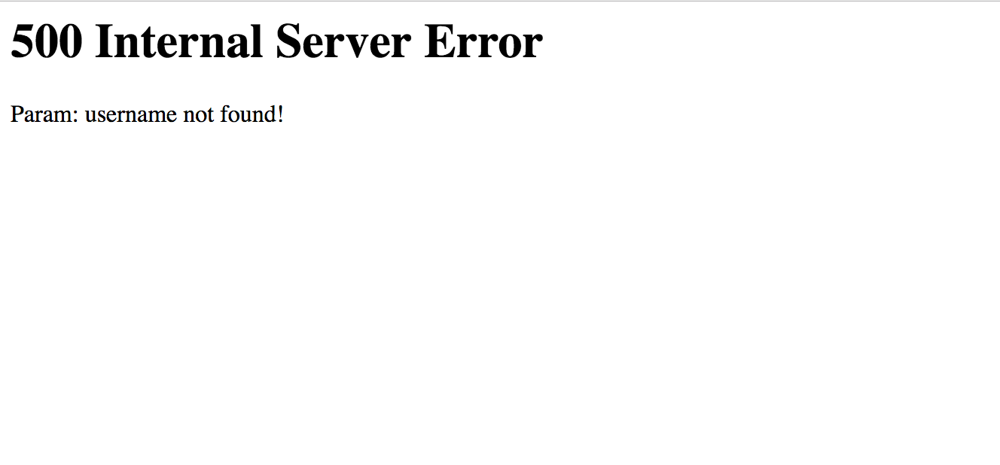

class: center, bottom, heading-black
background-image: url(images/ambiata-chopsticks.png)

# Caught in a web of functions

---

class: middle

<a href="https://www.reddit.com/r/haskell/comments/16kqe0/recommended_haskell_web_framework_for_beginners/">
  
</a>

---

class: middle

<a href="https://www.reddit.com/r/haskell/comments/2wfap0/web_development_using_haskell/">
  
</a>

---

class: middle

<a href="https://www.reddit.com/r/haskell/comments/1y3eff/the_simplest_haskell_web_framework_is/">
  
</a>

---

class: middle

<a href="https://www.reddit.com/r/haskell/comments/5gu7op/haskell_equivalent_of_spring_framework/">
  
</a>

---

class: center, middle, section-aqua, heading-white

# Why?

---

## Haskell Web Frameworks

- Happstack
- Scotty
- Snap
- Yesod
- Airship
- Spock
- Servant

---

class: center, middle, section-aqua, heading-white

## &lt;insert contrived example&gt;

---

class: center, middle, section-aqua, heading-white

# Scotty

---

class: code

```haskell
routes = do
  get "/login" $
    ...
  post "/login" $
    ...
  get "/profile/:user" $
    ...
```

---

class: code

```haskell
get "/login" $
  html $
    "<form method="POST" action="/login">" <>
    "  <input name="username" />" <>
    "</form>"
```

---

class: code

```haskell
post "/login" $ do
  user <- param "username"
  setCookie ("session", user)
  redirect ("/profile/" <> user)
```

???

- Content-Type

---

class: code

```haskell
get "/profile/:user" $ do
  c <- getCookie "session"
  case c of
    Nothing ->
      redirect "/login"
    Just session -> do
      user <- param "user"
      if session /= user then do
        status status403
        html "<body>Unauthorized"
      else
        html "<body>Authorized"
```

???

- Split into multiple page


---

class: center, middle, section-aqua, heading-white

# What is a web application?

???

- "Let's take a step back"
- TODO Image?

---

class: code

```haskell


type Application = ???
```

---

class: code

```haskell


type Application = Request ->    Response
```

---

class: code

```haskell


type Application = Request -> IO Response
```

???

- "But this is haskell and we need to be able to do side effects"

---

class: center, middle, section-aqua, heading-white

# WAI

---

class: center, middle, section-aqua, heading-white

# Web Application Interface

---

class: code

```haskell
-- http://hackage.haskell.org/package/wai
data Request

pathInfo :: Request -> [Text]
requestMethod :: Request -> Method
requestHeaders :: Request -> [Header]

data Response

responseStatus :: Response -> Status
responseHeaders :: Response -> [Header]
```

---

class: code

```haskell
-- http://hackage.haskell.org/package/wai
data Request

pathInfo :: Request -> [Text]
requestMethod :: Request -> Method
requestHeaders :: Request -> [Header]

data Response

responseStatus :: Response -> Status
responseHeaders :: Response -> [Header]

-- http://hackage.haskell.org/package/http-types
type Header = (ByteString, ByteString)
```

---

class: center, middle, section-yellow, heading-black

# Data + Functions

---

background-image: url(https://georgebrock.github.io/talks/command-line-ruby/images/lex.jpg)

???

- We're functional programmers - we know this


---

class: center, middle, section-aqua, heading-white

# What can I do with it?

---

class: code

```haskell
get "/login" $

  html $
    "<form method="POST" action="/login">" <>
    "  <input name="username" />" <>
    "</form>"
```

---

class: code

```haskell


  html $
    "<form method="POST" action="/login">" <>
    "  <input name="username" />" <>
    "</form>"
```

---

class: code

``` haskell
loginGet :: Response
loginGet =
  html $
    "<form method="POST" action="/login">" <>
    "  <input name="username" />" <>
    "</form>"
```

---

class: code

``` haskell
loginGet :: Response
loginGet =
  html $
    "<form method="POST" action="/login">" <>
    "  <input name="username" />" <>
    "</form>"

html :: ByteString -> Response
html =
  ???
```

---

class: code

```haskell
-- http://hackage.haskell.org/package/wai
responseLBS ::
  Status -> [Header] -> ByteString -> Response


html :: ByteString -> Response
html =
  ???
```

---

class: code

```haskell
-- http://hackage.haskell.org/package/wai
responseLBS ::
  Status -> [Header] -> ByteString -> Response

-- http://hackage.haskell.org/package/http-types
status200 :: Status

html :: ByteString -> Response
html =
  responseLBS
    status200
    [("Content-Type", "text/html")]
```

---

class: code

```haskell
loginGet :: Response
loginGet =
  html $
    "<form method="POST" action="/login">" <>
    "  <input name="username" />" <>
    "</form>"

html :: ByteString -> Response
html =
  responseLBS
    status200
    [("Content-Type", "text/html")]
```

---

class: center, middle, heading-white
background-image: url(https://georgebrock.github.io/talks/command-line-ruby/images/lex.jpg)

# Data + Functions


---

class: code

```haskell
post "/login" $ do
  user <- param "username"
  setCookie ("session", user)
  redirect ("/profile/" <> user)
```

---

class: code

```haskell

          param
  setCookie
  redirect
```

---

class: code

```haskell

          param
```

---

class: code

```haskell
-- http://hackage.haskell.org/package/wai
requestBody :: Request -> IO ByteString

-- http://hackage.haskell.org/package/http-types
parseQueryText ::
  ByteString -> [(Text, Maybe Text)]
```

---

class: code

```haskell
-- http://hackage.haskell.org/package/wai
requestBody :: Request -> IO ByteString

-- http://hackage.haskell.org/package/http-types
parseQueryText ::
  ByteString -> [(Text, Maybe Text)]

params :: Request -> IO [(Text, Maybe Text)]
params =
  requestBody >>= parseQueryText

```

---

class: code

```haskell


  redirect
```

---

class: code

```haskell
redirect :: ByteString -> Response
redirect uri =
  responseLBS
    status302
    [("Location", uri)]
    ""
```

---

class: code

```haskell


  setCookie
```

---

class: code

```haskell
setCookie :: Cookie -> Response -> Response
setCookie =
  ???
```

---

class: code

```haskell
setCookie :: Cookie -> Response -> Response
setCookie =
  ???


-- http://hackage.haskell.org/package/wai
mapResponseHeaders ::
 ([Header] -> [Header]) -> Response -> Response

-- http://hackage.haskell.org/package/cookie
renderCookie :: Cookie -> ByteString
```

---

class: code

```haskell
setCookie :: Cookie -> Response -> Response
setCookie cookie =
  mapResponseHeaders $ \headers ->
    ("Set-Cookie", renderCookie cookie) : headers

-- http://hackage.haskell.org/package/wai
mapResponseHeaders ::
 ([Header] -> [Header]) -> Response -> Response

-- http://hackage.haskell.org/package/cookie
renderCookie :: Cookie -> ByteString
```

---

class: code

```haskell
loginPost :: Request -> IO Response
loginPost request = do
  b <- params request
    ...


params :: Request -> IO [(Text, Maybe Text)]
```

---

class: code

```haskell
loginPost :: Request -> IO Response
loginPost request = do
  b <- params request
  case lookup "username" b of
    Nothing ->
      ???

    Just user ->
      ...
```

---

class: image, top



---

class: code

```haskell
loginPost :: Request -> IO Response
loginPost request = do
  b <- params request
  case lookup "username" b of
    Nothing ->
      responseLBS status400 [] $
        "<body>Bad request"
    Just user ->
      ...
```

---

class: code

```haskell
loginPost :: Request -> IO Response
loginPost request = do
  b <- params request
  case lookup "username" b of
    Nothing ->
      responseLBS status400 [] $
        "<body>Bad request"
    Just user ->
      ...
        redirect ("/profile/" <> user)

redirect :: ByteString -> Response
```

---

class: code

```haskell
loginPost :: Request -> IO Response
loginPost request = do
  b <- params request
  case lookup "username" b of
    Nothing ->
      responseLBS status400 [] $
        "<body>Bad request"
    Just user ->
      setCookie ("session", user) $
        redirect ("/profile/" <> user)

setCookie :: Cookie -> Response -> Response
```

---

class: center, middle, heading-white
background-image: url(https://georgebrock.github.io/talks/command-line-ruby/images/lex.jpg)

# Data + Functions


---

class: code

```haskell
get "/profile/:user" $ do
  c <- getCookie "session"
  case c of
    Nothing ->
      redirect "/login"
    Just session -> do
      user <- param "user"
      if session /= user then do
        status status403
        html "<body>Not allowed"
      else
        html "<body>Hello"
```

---

class: code

```haskell

       getCookie


      redirect


        status
        html

        html
```

---

class: code

```haskell

       getCookie
```

---

class: code

```haskell
getCookie ::
  Request -> ByteString -> Maybe ByteString
getCookie request name = do
  ...
```

---

class: code

```haskell
getCookie ::
  Request -> ByteString -> Maybe ByteString
getCookie request name = do
  ...


-- http://hackage.haskell.org/package/cookie
parseCookies : ByteString -> Cookies
```

---

class: code

```haskell
getCookie ::
  Request -> ByteString -> Maybe ByteString
getCookie request name = do
 cs <- lookup "Cookie" (requestHeaders request)
 lookup name (parseCookies cs)

-- http://hackage.haskell.org/package/cookie
parseCookies : ByteString -> Cookies
```

---

class: code

```haskell


        status
        html
```

---

class: code

```haskell
html :: ByteString -> Response
html =
  responseLBS
    status200
    [("Content-Type", "text/html")]
```

---

class: code

```haskell
html :: Status -> ByteString -> Response
html status =
  responseLBS
    status
    [("Content-Type", "text/html")]
```

---

class: code

```haskell

       getCookie


      redirect


        status
        html

        html
```

---

class: code

```haskell
userGet :: User -> Request -> Response
userGet user request -> do
  case getCookie request "session" of
    Nothing ->
      ...
    Just session ->
      ...


getCookie ::
  Request -> ByteString -> Maybe ByteString
```

---

class: code

```haskell
userGet :: User -> Request -> Response
userGet user request -> do
  case getCookie request "session" of
    Nothing ->
      redirect "/login"
    Just session ->
      ...


redirect :: ByteString -> Response
```

---

class: code

```haskell
userGet :: User -> Request -> Response
userGet user request -> do
  case getCookie request "session" of
    Nothing ->
      redirect "/login"
    Just session ->
      if session /= user then
        html status403 $
          "<body>Not permitted"
      else
        html status200 $
          "<body>Hello"

html :: Status -> ByteString -> Response
```

---

class: code

```haskell
userGet :: User -> Request -> Response
userGet user request -> do
  case getCookie request "session" of
    Nothing ->
      redirect "/login"
    Just session ->
      if session /= user then
        html status403 $
          "<body>Not permitted"
      else
        html status200 $
          "<body>Hello"
```

---

class: center, middle, heading-white
background-image: url(https://georgebrock.github.io/talks/command-line-ruby/images/lex.jpg)

# Data + Functions


---

class: center, middle, section-aqua, heading-white

# Routing

---

class: code

```haskell
loginGet :: IO Response

loginPost :: Request -> IO Response

userGet :: User -> Request -> IO Response
```

---

class: code

```haskell
routes = do
  get "/login" $
    ...
  post "/login" $
    ...
  get "/profile/:user" $
    ...
```

---

class: code

```haskell


-- http://hackage.haskell.org/package/wai
pathInfo :: Request -> [Text]
```

---

class: code

```haskell
myApp :: Request -> IO Response
myApp request =
  case pathInfo request of
    ["login"] ->
      ...
    ["profile", user] ->
      ...

-- http://hackage.haskell.org/package/wai
pathInfo :: Request -> [Text]
```

---

class: code

```haskell
myApp :: Request -> IO Response
myApp request =
  case pathInfo request of
    ["login"] ->
      ...
    ["profile", user] ->
      ...

-- http://hackage.haskell.org/package/wai
pathInfo :: Request -> [Text]
```

<pre><code class="hljs"><span style="color: #FFC039;">Warning: Pattern match(es) are non-exhaustive</span>
</code></pre>

---

class: image, top


---

class: image, top


---

class: code

```haskell
myApp :: Request -> IO Response
myApp request =
  case pathInfo request of
    ["login"] ->
      ...
    ["profile", user] ->
      ...
    _ ->
      html status404 $
        "<body>Not found"
```

???

- "Interesting, now _we_ have to deal with the 404"
- Less than ideal, what does the 404 look like?

---

class: code

```haskell


-- http://hackage.haskell.org/package/wai
requestMethod :: Request -> Method
```

---

class: code

```haskell
myApp :: Request -> IO Response
myApp request =
  case pathInfo request of
    ["login"] ->
      case requestMethod request of
        "GET" ->
           ...
        "POST" ->
           ...

-- http://hackage.haskell.org/package/wai
requestMethod :: Request -> Method
```

---

class: code

```haskell
myApp :: Request -> IO Response
myApp request =
  case pathInfo request of
    ["login"] ->
      case requestMethod request of
        "GET" ->
           ...
        "POST" ->
           ...

-- http://hackage.haskell.org/package/wai
requestMethod :: Request -> Method
```

<pre><code class="hljs"><span style="color: #FFC039;">Warning: Pattern match(es) are non-exhaustive</span>
</code></pre>

---

class: code

```haskell
myApp :: Request -> IO Response
myApp request =
  case pathInfo request of
    ["login"] ->
      case requestMethod request of
        "GET" ->
           ...
        "POST" ->
           ...
        _ ->
          html status405 $
            "<body>Not Allowed"
```

---

class: center, middle, heading-white
background-image: url(https://georgebrock.github.io/talks/command-line-ruby/images/lex.jpg)

# Data + Functions

---

class: code

```haskell
myApp :: Request -> IO Response
myApp req =
  case pathInfo req of
    ["login"] ->
      case reqMethod req of
        "GET" ->
           loginGet
        "POST" ->
           loginPost req
    ["profile", user] ->
      case reqMethod req of
        "GET" ->
           userGet user req
```

---

class: code

```haskell
myApp :: Request -> IO Response
myApp req =
  case (reqMethod req, pathInfo req) of
    ("GET", ["login"]) ->
      loginGet
    ("POST", ["login"]) ->
      loginPost req
    ("GET", ["profile", user]) ->
      userGet user req
```

---

class: center, middle, section-yellow, heading-black

# Type Safe Routing?

---

class: code

```haskell
routes = do
  ...
  get "/profile/:user" $
    user <- getParam "user"
```

---

class: code

```haskell
routes = do
  ...
  get "/profile/:foo" $
    user <- getParam "bar"
```

???

- Needs type safety

---

class: image, top


---

## Haskell Routing

- [web-routes](http://hackage.haskell.org/package/web-routes)
- [web-routes-boomerang](http://hackage.haskell.org/package/web-routes-boomerang)
- [wai-routing](http://hackage.haskell.org/package/wai-routing)
- [wai-routes](https://hackage.haskell.org/package/wai-routes)
- [waitra](https://hackage.haskell.org/package/waitra)
- [snap-web-routes](http://hackage.haskell.org/package/snap-web-routes)
- [reroute](http://hackage.haskell.org/package/reroute)

???

- I'm not suggesting pattern matching is way to do routing
- Cottage Industry

---

class: code

```haskell
myApp :: Request -> IO Response
myApp req =

  case (reqMethod req, pathInfo req) of
    ("GET", ["login"]) ->
        loginGet
    ("POST", ["login"]) ->
        loginPost req
    ("GET", ["profile", user]) ->
        userGet user req
```

---

class: code

```haskell
myApp :: Request -> IO Response
myApp     =


        loginGet

        loginPost

        userGet
```

---

class: code

```haskell
myApp :: Request -> IO Response
myApp     =
  -- https://hackage.haskell.org/package/waitra
  waitraMiddleware [
      routeGet $
        loginGet <* string "login"
    , routePost $
        loginPost <* string "login"
    , routeGet $
        userGet <$ string "profile" <*> var
    ]
```


---

class: center, middle, section-aqua, heading-white

# How do I run it?

---

class: code

```haskell
type Application = Request -> IO Response
```

---

class: code

```haskell
type Application = Request -> IO Response


run :: Port -> Application -> IO ()
```

---

class: center, middle, section-aqua, heading-white

# Warp

???

- One of the most common web servers

---

class: code

```haskell
type Application = Request -> IO Response

-- http://hackage.haskell.org/package/warp
run :: Port -> Application -> IO ()
```

---

class: code

```haskell
type Application = Request -> IO Response

-- http://hackage.haskell.org/package/warp
run :: Port -> Application -> IO ()

main :: IO ()
main =
  run 8080 $ \request ->
    case pathInfo request of
      ["login"] ->
        ...
      ["profile", user] ->
        ...
```


---

class: image, bottom


---

class: code

```haskell
type Application =
  Request ->
  IO Response
```

---

class: code

```haskell
type Application =
  Request ->
  (Response -> IO ResponseReceived) ->
  IO ResponseReceived
```

???

- See resources at the end

---

class: code

```haskell
type Application =
  Request ->
  IO Response


myApp :: Application
myApp request         =
  case pathInfo request of
    ["login"] ->
      return $
        html "..."
```

---

class: code

```haskell
type Application =
  Request ->
  (Response -> IO ResponseReceived) ->
  IO ResponseReceived

myApp :: Application
myApp request respond =
  case pathInfo request of
    ["login"] ->
      respond $
        html "..."
```


---

class: center, middle, section-aqua, heading-white

# What web framework should I use?

---

class: center, middle, section-aqua, heading-white

# What is a web application?

---

class: center, middle, section-aqua, heading-white

# Request -> IO Response

---

class: center, middle, section-aqua, heading-white

# Data + Functions

---

## Web Libraries

- [wai](https://hackage.haskell.org/package/wai)
- [http-types](https://hackage.haskell.org/package/http-types)
- [cookie](https://hackage.haskell.org/package/cookie)
- [http-media](https://hackage.haskell.org/package/http-media)
- [wai-extra](https://hackage.haskell.org/package/wai-extra)

---

## Resources

- http://blog.infinitenegativeutility.com/2016/8/resources--laziness--and-continuation-passing-style
- https://github.com/charleso/lambdajam-web-functions
- "Build yourself a Haskell web framework"
  - https://www.youtube.com/watch?v=etuSnom2v2M
